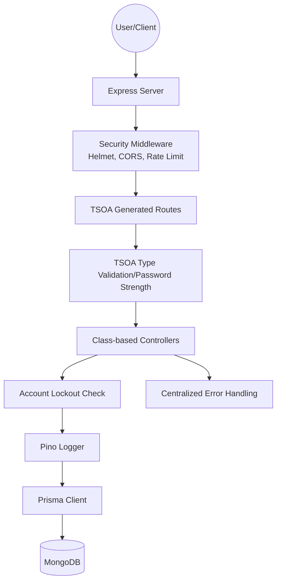

# Backend Architecture - mono-server

This document provides a comprehensive overview of the backend architecture for the mono-server project.

## High-Level Overview

mono-server is a Node.js TypeScript server designed for high performance, security, and scalability. It follows a modular structure, separating concerns across middleware, controllers, models, and utility layers.



## Tech Stack

| Component | Technology | Description |
| :--- | :--- | :--- |
| **Runtime** | Node.js (v20+) | Execution environment. |
| **Language** | TypeScript | Type-safe development. |
| **Framework** | Express | Web framework. |
| **Security** | CORS, Helmet | Secure headers and origin control. |
| **Database** | MongoDB | NoSQL database. |
| **ORM** | Prisma | Modern ORM with type-safe client. |
| **Validation** | TSOA | Type-based validation via decorators. |
| **Hashing** | Argon2 | Secure password hashing. |
| **Logging** | Pino | Low-overhead logging. |
| **Documentation**| TSOA / Swagger| Automatically generated OpenAPI spec. |
| **Testing** | Jest | JavaScript testing framework. |
| **Container** | Docker + docker-compose | Multi-stage build and local orchestration. |

## Directory Structure

```text
backend/
├── prisma/             # Prisma schema and migrations
├── src/
│   ├── __tests__/      # Jest test suites
│   │   ├── cache/          # Cache layer tests
│   │   ├── controllers/    # Controller tests
│   │   ├── middleware/     # Middleware tests
│   │   ├── resilience/     # Circuit breaker & retry tests
│   │   ├── security/       # JWT & lockout tests
│   │   ├── utilities/      # Utility tests
│   │   └── index.test.ts   # Test suite runner
│   ├── cache/          # Production-grade cache layer
│   ├── config/         # Generated OpenAPI spec (swagger.json)
│   ├── controllers/    # Class-based TSOA controllers
│   ├── examples/       # Usage examples for cache & resilience
│   ├── middleware/     # Security and Error handlers
│   ├── routes/         # TSOA generated Express routes
│   ├── types/          # TypeScript type definitions
│   ├── utils/          # Logger, Version, Prisma singleton
│   └── server.ts       # Main entry point
├── tsoa.json           # TSOA configuration
├── Dockerfile          # Optimized build definition
└── package.json        # Manifest and scripts
```

## Key Components

### 1. Security
- **Helmet & CORS**: Secure HTTP headers and cross-origin controls.
- **Rate Limiting**: Multi-factor brute-force protection.
- **Account Lockout**: Redis-based temporary lockout after 5 failed attempts.
- **Password Strength**: Backend enforcement of complex passwords.
- **CSP**: Content Security Policy headers via Helmet
  - `defaultSrc: ["'self'"]`
  - `styleSrc: ["'self'", "'unsafe-inline'"]`
  - `scriptSrc: ["'self'"]`
  - `imgSrc: ["'self'", "data:", "https:"]`

### 2. Database & ORM
- **Prisma**: ORM Centrally managed via `src/utils/prisma.ts` with connection pooling
- **MongoDB**: Used as the persistent storage layer and configured via Prisma
- **Monitoring**: Connection status checked via health endpoint

### 3. Error Handling
- **Centralized Middleware**: `errorHandler.ts` catches all errors, logs them via Pino, and ensures consistent JSON responses.

### 4. Observability
- **Pino**: Structured logging with `LOG_LEVEL` control.
- **Health Check**: `/health` exposes server status and versioning metadata.

### 5. Containerization
- **Multi-stage Build**: `backend/Dockerfile` builds the TypeScript source and produces a small production image.
- **Native Modules**: `argon2` is compiled in the build stage on Alpine and reused in the runtime image.
- **Prisma**: Client generation is integrated into the container build via `prisma.config.ts` and `prisma/schema.prisma`.
- **docker-compose**: `docker-compose.yml` defines:
  - `backend`: the mono-server API container (exposes port 8080) built from `backend/Dockerfile`.
  - `mongo`: the MongoDB database used by Prisma, exposed on port 27017.
- **Local workflow**:
  - Build and start the stack: `docker-compose up --build`.
  - Access API: `http://localhost:8080`.
  - Access Swagger docs: `http://localhost:8080/api/docs`.

### 6. Compression
- **Middleware**: `compression` package applied to all responses
- **Benefit**: Reduces payload size for large JSON responses and real-time data streaming

## Data Flow

1.  **Request**: Client hits an endpoint.
2.  **Middleware**: Security headers and rate limits applied.
3.  **Routing**: TSOA-generated routes dispatch to class-based controllers.
4.  **Validation**: TSOA validates inputs based on TypeScript types/decorators.
5.  **Controller**: Executes business logic using the Prisma Client.
6.  **Error Handling**: Any thrown error is caught by the centralized handler.
7.  **Response**: Structured JSON response returned to client.
8.  **Logging**: Workflow steps logged via Pino.

---

## Authentication (Tokens)

mono-server uses a secure JWT-based authentication system with Access and Refresh tokens.

| Token | Lifetime | Storage | Usage |
| :--- | :--- | :--- | :--- |
| **Access Token** | 15 min | Client Memory (State) | API authorization via `Authorization: Bearer <token>` |
| **Refresh Token**| 7 days | HttpOnly, Secure, SameSite=Strict Cookie | Token rotation via `/api/auth/refresh` |

### Security Features
- **Token Rotation**: Every time a token is refreshed, a new pair is issued and the old refresh token is revoked in the database.
- **Database Validation**: Refresh tokens are hashed (SHA-256) before storage. The server validates the hash against the database on every refresh request.
- **Brute-force Protection**: Account lockout (15 min) after 5 failures
- **CSRF Protection**: Double Submit Cookie pattern — server sets a `csrfToken` cookie (non-HttpOnly, SameSite=Strict) after login/register/refresh; state-mutating requests must include `X-CSRF-Token` header matching the cookie value. Login/register endpoints are exempt (no session yet).
- **Centralized Auth**: All protected routes require the `@Security('bearerAuth')` decorator.

---

## Resilience & Reliability

### Request Correlation & Distributed Tracing
- **X-Request-ID**: Auto-generated UUID for each request
- **Middleware**: `requestIdMiddleware` adds request ID to headers and response
- **Logging**: All logs include `requestId` via `req.log` (Pino child logger)

### Circuit Breaker Pattern
- **Library**: Opossum
- **Purpose**: Prevents cascading failures when external APIs are down
- **Configuration**: Timeout (3s), error threshold (50%), reset timeout (30s)

### Retry Strategy with Exponential Backoff
- **Purpose**: Resilient external API calls with automatic retry
- **Configuration**: Max retries (3), initial delay (1s), max delay (10s), factor (2)

### Job Queue / Task Scheduler
- **Library**: BullMQ (Redis-backed)
- **Purpose**: Async task processing, external API polling, data aggregation
- **Features**: Job scheduling, retry, rate limiting, priority queues

### Graceful Shutdown
- **Signals**: SIGTERM, SIGINT
- **Process**: 
  1. Stop accepting new requests
  2. Close HTTP server
  3. Disconnect Prisma
  4. Close Redis connections
  5. Exit with appropriate code
- **Timeout**: 10s forced shutdown

---

## Caching Layer (Production-Grade with Automatic Fallback)

mono-server implements a production-grade cache layer with automatic fallback to ensure high availability and zero downtime.

### Architecture Overview

```
┌─────────────────────────────────────────────────┐
│           CacheService (Public API)             │
│  - get<T>(namespace, key)                       │
│  - set(namespace, key, value, ttl)              │
│  - invalidate(namespace, key)                   │
└────────────────┬────────────────────────────────┘
                 │
                 ▼
┌─────────────────────────────────────────────────┐
│            CacheManager (Singleton)             │
│  - Automatic adapter selection                  │
│  - Graceful fallback handling                   │
│  - Health monitoring                            │
└────────────┬────────────────────────────────────┘
             │
    ┌────────┴────────┐
    ▼                 ▼
┌──────────────┐  ┌──────────────────┐
│ Redis Cache  │  │  Memory Cache    │
│  (Primary)   │  │   (Fallback)     │
│              │  │                  │
│ - ioredis    │  │ - Map + TTL      │
│ - Fast fail  │  │ - Auto cleanup   │
└──────────────┘  └──────────────────┘
```

### CacheAdapter Interface (src/cache/CacheAdapter.ts)
    - Defines get, set, and delete methods with two implementations.

#### 1. RedisCacheAdapter (Primary)
- Uses **ioredis** with `maxRetriesPerRequest: 1` for fast failure
- Exponential retry (max 3 retries, ≤3s delay) with Lazy connection initialization  
- Health tracked via `connect`, `error`, `reconnecting` events  
- Operations wrapped in `try/catch`

#### 2. MemoryCacheAdapter (Fallback)
- In-memory `Map` with TTL support  
- Per-key expiration  
- Cleanup every **60s**

### CacheManager (Singleton)
- Chooses Redis or memory cache based on Redis health  
- Automatic fallback on Redis failure  
- Logs cache transitions  
- Prevents application crashes if Redis is unavailable

### Redis Configuration
- Self-hosted via Docker  
- Configured with `REDIS_HOST`, `REDIS_PORT`, `REDIS_PASSWORD`  
- Automatic fallback when unavailable

### Cache Implementation
- Key format: `mono-server:v1:<namespace>:<key>`  
- All entries use TTL

### Rate Limiting
- Redis-backed via `rate-limit-redis` with memory fallback.
- **Privacy**: Sensitive identifiers are hashed (SHA-256) before storage in Redis.
- **Limits**: Global and Auth-specific limits for dedicate privacy.

### Security
- No sensitive data (passwords, tokens) is cached
- Redis credentials are stored in environment variables
- Cache keys are validated to prevent injection attacks
- All operations are async-safe and thread-safe

---

## API Versioning

mono-server implements API versioning to prevent breaking changes for clients.

- **Configuration**: Defined in `tsoa.json` via `basePath` property
- **Routes**: All API endpoints are prefixed with basePath `/api/v1/`
- **Deprecation Path**: Future versions (v2, v3) can coexist with v1

---

## Monitoring & Alerting

mono-server uses Prometheus for metrics collection and Grafana for visualization.
See [MONITORING.md](MONITORING.md) for detailed setup instructions.

### Prometheus Metrics
- **Port**: 9090 (Prometheus UI)
- **Endpoint**: `/api/v1/metrics`
- **Metrics Collected**:
  - `http_request_duration_seconds` - Request latency histogram
  - `http_requests_total` - Total HTTP requests
  - `http_errors_total` - Total HTTP errors
  - `cache_hits_total` / `cache_misses_total` - Cache performance
  - `queue_depth` - Job queue depth
  - System metrics (CPU, memory, event loop)

### Grafana
- **Port**: 3000
- **Data Source**: Prometheus (auto-provisioned along with dashboard)
- **Features**: Real-time visualization, alerting, custom dashboards

### Retention Policies
- **Development**: 30 days / 10GB
- **Production**: 90 days / 50GB

### External Health Checks
- **Endpoint**: `/api/v1/external-health`
- **Response**: Status (healthy/degraded/unhealthy) with latency metrics

---